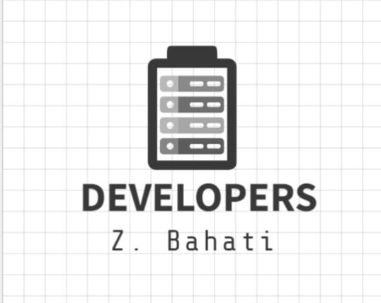

<a name="readme-top"></a>

# 📗 Table of Contents

- [📖 About the Project](#about-project)
  - [🛠 Built With](#built-with)
    - [Tech Stack](#tech-stack)
    - [Key Features](#key-features)
- [💻 Getting Started](#getting-started)
  - [Setup](#setup)
  - [Prerequisites](#prerequisites)
  - [Install](#install)
  - [Usage](#usage)
  - [Run tests](#testing)
- [👥 Authors](#authors)
- [🔭 Future Features](#future-features)
- [🤝 Contributing](#contributing)
- [⭐️ Show your support](#support)
- [🙏 Acknowledgements](#acknowledgements)
- [❓ FAQ](#faq)
- [📝 License](#license)

# 📖 Budget App <a name="about-project"></a>

 BudgetApp is about building a mobile web application where you can manage your budget: you have a list of transactions associated with a category, so that you can see how much money you spent and on what.

### Tech Stack <a name="tech-stack"></a>

<details>
<summary>Backend</summary>
  <ul>
    <li><a href="https://www.ruby-lang.org/en/">Ruby on rails</a></li>
    <li><a href="https://www.ruby-lang.org/en/">Postgresql Database</a></li>
  </ul>
</details>
<details>
<summary>Frontend</summary>
  <ul>
    <li><a href="https://www.ruby-lang.org/en/">Html</a></li>
    <li><a href="https://www.ruby-lang.org/en/">CSS</a></li>
    <li><a href="https://www.ruby-lang.org/en/">Bootstrap</a></li>
  </ul>

</details>

### Demo <a name="demo-link"></a>

- Video demo
https://www.loom.com/share/a90fab36e4ef434598cc7991f77b1b7b?sid=d098e8b0-0bbb-4c95-a99c-9e68bfd4fdd1

- Project live on Server
    https://budgetapp-htg3.onrender.com

### Key Features <a name="key-features"></a>

- Built MVC using Rails framework

<p align="right">(<a href="#readme-top">back to top</a>)</p>


## 💻 Getting Started <a name="getting-started"></a>

## Prerequisites <a name="prerequisites">

- Ruby installed on your system
- Rails installed on your system
- Postgresql installed on system

## Installation <a name="install">

1. Clone this repository to your local machine:

   ```bash
   git clone https://github.com/zbahati/budgetApp
   ```

2. Navigate to the project directory:

   ```bash
   cd budgetApp
   ```
3. Run this command to start application in browser on the port http:\\127.0.0.1:300:

   ```bash
   rails s
   or
   rails server

   ```

<p align="right">(<a href="#readme-top">back to top</a>)</p>

## Testing <a name="testing">

1. To run the tests for this project:

  ```bash
  rspec
  or
  bundle exec rspec
  ```

<p align="right">(<a href="#readme-top">back to top</a>)</p>

## 👥 Authors <a name="authors"></a>

👤 **Bahati**

- GitHub: [@githubhandle](https://github.com/zbahati/)
- LinkedIn: [LinkedIn](https://www.linkedin.com/in/zirimwabagabo-bahati/)

<p align="right">(<a href="#readme-top">back to top</a>)</p>

## 🔭 Future Features <a name="future-features"></a>

 - Add UI
 - Make UI responsive to the different devices
 - Add test
 - seach using ransack
 - cancan for authorization
 - kaminari for pagination


<p align="right">(<a href="#readme-top">back to top</a>)</p>

## 🤝 Contributing <a name="contributing"></a>

Contributions, issues, and feature requests are welcome!

Feel free to check the [issues page](https://github.com/zbahati/recipeApp/issues).

<p align="right">(<a href="#readme-top">back to top</a>)</p>

## ⭐️ Show your support <a name="support"></a>

If you like this project, you can support me by clicking on the start

<p align="right">(<a href="#readme-top">back to top</a>)</p>

## 🙏 Acknowledgments <a name="acknowledgements"></a>

1. I would like to thank Microverse for this learning and reviewing our progress

2. The design for this project is based on the work created by [Gregoire Vella](https://www.behance.net/gregoirevella) and is used under the terms of the Creative Commons license.

<p align="right">(<a href="#readme-top">back to top</a>)</p>

## ❓ FAQ <a name="faq"></a>

- **[Whould I stop the project at this point?]**

  - No, I plan to create something big. Stay tuned to the next update

<p align="right">(<a href="#readme-top">back to top</a>)</p>

## 📝 License <a name="license"></a>

This project is [MIT](LICENSE) licensed.

<p align="right">(<a href="#readme-top">back to top</a>)</p>